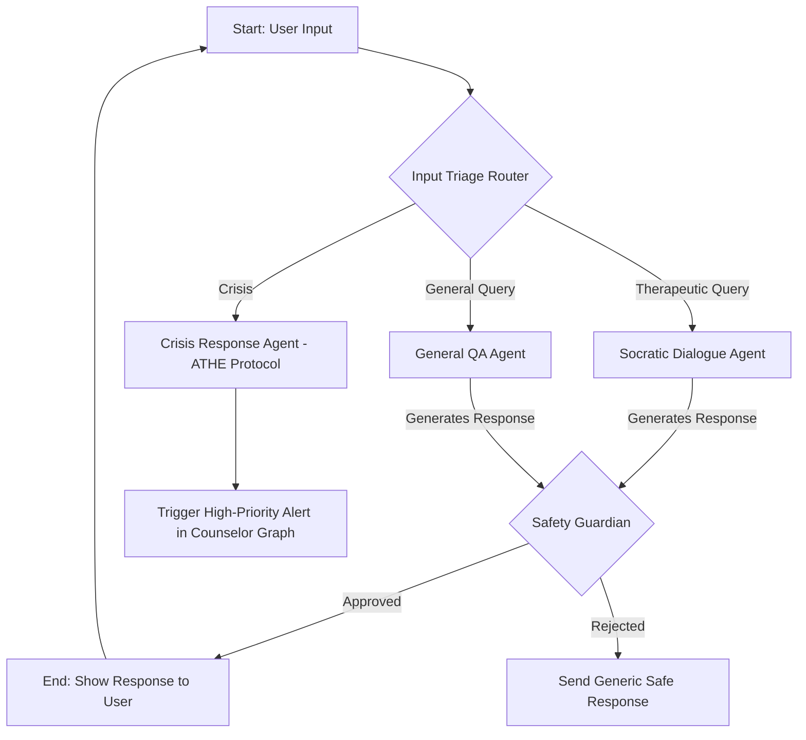
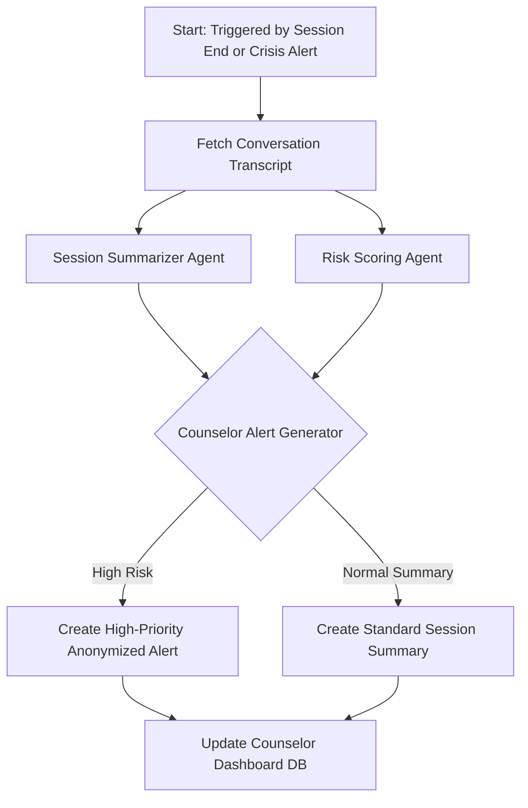

# Eira: AI Mental Wellness Companion - Architecture Document

## 1. High-Level Vision

**Eira** is a multi-agent, AI-native mental wellness ecosystem delivered as a Progressive Web App (PWA). It provides students with a 24/7 personalized AI companion for first-line support while equipping university counselors with an AI "Co-Pilot" to streamline their workflow and identify at-risk students proactively.

This architecture is designed for a **hackathon demonstration using Streamlit**, prioritizing rapid development, powerful AI capabilities, and a clear, compelling narrative.

---

## 2. System Architecture Overview

The system follows a classic three-tier architecture: a frontend for user interaction, a backend to handle logic and API requests, and a data layer for storage and retrieval. The AI Core is the central, most sophisticated component, integrated deeply into the backend.

```mermaid
graph TD
    subgraph Frontend (Hackathon Demo)
        A[Streamlit PWA]
    end

    subgraph Backend API
        B(FastAPI Server)
    end

    subgraph AI Core (LangGraph)
        C{Student Interaction Graph}
        D{Analysis & Triage Graph}
    end

    subgraph Data Stores
        E[Vector DB: ChromaDB]
        F[Relational DB: SQLite]
    end

    A -- HTTP Requests --> B
    B -- Invokes --> C
    B -- Triggers --> D
    C -- Reads/Writes --> E
    C -- Reads/Writes --> F
    D -- Reads --> F
    D -- Generates/Updates --> F
```

---

## 3. Technology Stack

This stack is chosen for its **Python-centric ecosystem**, allowing for seamless integration between the UI, backend, and AI, which is ideal for rapid prototyping.

### **Frontend (Demo)**
* **Framework:** **Streamlit**
    * **Reasoning:** Perfect for a hackathon. It allows us to build a beautiful, interactive, and data-centric UI with pure Python. Its chat components (`st.chat_message`, `st.chat_input`) are ideal for demonstrating the Eira companion.

### **Backend**
* **API Framework:** **FastAPI**
    * **Reasoning:** High-performance, asynchronous support is critical for handling LLM calls without blocking. Its Python type hints and automatic documentation generation speed up development significantly.
* **Server:** **Uvicorn**
    * **Reasoning:** The standard, high-performance ASGI server for FastAPI.

### **AI Core**
* **Agentic Framework:** **LangGraph**
    * **Reasoning:** Its stateful graph structure is essential for our multi-agent collaboration, enabling cycles and complex conditional routing that a simple chain cannot handle. This is our core technical differentiator.
* **Underlying LLM:** **OpenAI's `gpt-4o-mini` or Anthropic's `claude-3-haiku` (via API)**
    * **Reasoning:** For the demo, using a powerful, reliable API is faster than hosting and fine-tuning an open-source model. These models are fast, cheap, and have excellent reasoning capabilities for the Socratic and summarization tasks.
* **Embedding Model:** **`Sentence-Transformers/all-MiniLM-L6-v2`**
    * **Reasoning:** A lightweight, fast, and effective model that can run locally. Perfect for converting text chunks into vectors for our RAG system.

### **Data Stores**
* **Vector Database:** **ChromaDB**
    * **Reasoning:** Easy to set up and can run in-memory or as a local file, requiring zero configuration for the demo. It's fully integrated with LangChain/LangGraph.
* **Relational Database:** **SQLite**
    * **Reasoning:** Included with Python. It's perfect for storing user session data, conversation history, and counselor alerts for the demo without needing a separate database server.

---

## 4. Detailed AI Workflow Architecture (LangGraph)

This is the heart of Eira. We will implement the two primary graphs discussed, which run on the FastAPI backend.

### **AI Graph 1: Student Interaction Graph**

This graph manages the real-time conversation with the student.



#### **Node Descriptions:**
* **`Input_Triage_Router` (Node):** A small classification model or a prompted LLM call that routes the user's query.
* **`Crisis_Response_Agent` (Node):** A deterministic node. It does **not** call an LLM for conversation. It serves static, safe helpline information and immediately triggers a backend alert.
* **`Socratic_Dialogue_Agent` (Node):** The main LLM agent. It uses **RAG** to query ChromaDB (loaded with CBT techniques and your J&K cultural dataset) to inform its Socratic, non-directive responses.
* **`Safety_Guardian` (Node):** A final, crucial check. It uses a strong LLM with a strict prompt to vet the AI's response for safety before it's sent to the user.

### **AI Graph 2: Asynchronous Analysis & Triage Graph**

This graph runs in the background. It is triggered by the Crisis Agent or on a schedule (e.g., after a session ends).



#### **Node Descriptions:**
* **`Session_Summarizer_Agent` (Node):** Uses an LLM to condense the chat log into a structured SOAP note format.
* **`Risk_Scoring_Agent` (Node):** Analyzes the full transcript for risk patterns, updating a score in the SQLite database.
* **`Counselor_Alert_Generator` (Node):** A logic-driven node that decides the priority of the alert based on the summary and risk score, creating the final JSON object to be stored and displayed.

---

## 5. Demo Strategy with Streamlit

Your Streamlit app should have **two tabs or pages** to perfectly execute the "Golden Thread" demo:

### **1. Student View (`Eira Companion`):**
* A full-page chat interface (`st.chat_message`).
* The user (or judge) can type in this chat window.
* An SOS button that, when pressed, demonstrates the `Crisis_Response_Agent`.

### **2. Counselor View (`Counselor Co-Pilot`):**
* A dashboard that **auto-refreshes** every few seconds.
* It displays a list of anonymized student sessions (e.g., User 1138, User 2049).
* When the "Golden Thread" demo runs and a crisis is flagged, a new **high-priority alert** should appear at the top of this dashboard in real-time.
* Clicking the alert shows the AI-generated summary from the `Session_Summarizer_Agent`.

This two-tab setup allows you to seamlessly showcase the entire cause-and-effect workflow, from student input to AI analysis to the final, actionable insight for the human counselor.

---

## 6. Data Models

### **User Session**
```python
class UserSession:
    session_id: str
    user_id: str (anonymized)
    start_time: datetime
    end_time: Optional[datetime]
    status: Enum["active", "completed", "crisis"]
    risk_score: float
```

### **Conversation Message**
```python
class Message:
    message_id: str
    session_id: str
    timestamp: datetime
    role: Enum["user", "assistant", "system"]
    content: str
    metadata: dict
```

### **Counselor Alert**
```python
class CounselorAlert:
    alert_id: str
    session_id: str
    priority: Enum["low", "medium", "high", "critical"]
    summary: str
    risk_factors: List[str]
    created_at: datetime
    acknowledged: bool
```

---

## 7. API Endpoints

### **Student Interface**
- `POST /api/chat/message` - Send message and get AI response
- `GET /api/chat/session/{session_id}` - Retrieve session history
- `POST /api/chat/session/new` - Start new chat session
- `POST /api/emergency/sos` - Trigger crisis protocol

### **Counselor Interface**
- `GET /api/counselor/alerts` - Fetch all alerts
- `PUT /api/counselor/alerts/{alert_id}/acknowledge` - Mark alert as acknowledged
- `GET /api/counselor/sessions` - List all sessions with summaries
- `GET /api/counselor/dashboard/stats` - Get dashboard statistics

---

## 8. Security & Privacy Considerations

### **Data Protection**
- All user data is anonymized with generated IDs
- No personally identifiable information (PII) stored
- Conversation data encrypted at rest
- HTTPS only for all communications

### **AI Safety**
- Multi-layer safety checks before responses
- Crisis detection with immediate human escalation
- Content filtering and moderation
- Regular safety prompt auditing

### **Compliance**
- FERPA compliance for student data
- HIPAA considerations for mental health information
- Local data storage to maintain jurisdiction

---

## 9. Deployment Architecture

### **Development (Hackathon)**
```
Local Machine
├── Streamlit Frontend (Port 8501)
├── FastAPI Backend (Port 8000)
├── ChromaDB (Local file)
└── SQLite (Local file)
```

### **Production Considerations**
```
Cloud Infrastructure
├── Frontend: Streamlit Cloud / Heroku
├── Backend: AWS Lambda / Google Cloud Run
├── Vector DB: Pinecone / Weaviate Cloud
├── Database: PostgreSQL (AWS RDS)
└── Monitoring: DataDog / New Relic
```

---

## 10. Performance Metrics

### **Student Experience**
- Response time < 3 seconds
- 24/7 availability (99.9% uptime)
- Conversation quality scores
- User satisfaction ratings

### **Counselor Efficiency**
- Alert accuracy and precision
- False positive rate < 5%
- Summary generation time < 30 seconds
- Dashboard load time < 2 seconds

### **System Performance**
- API response time < 500ms
- Database query time < 100ms
- Concurrent user capacity: 100+
- Resource utilization monitoring

---

## 11. Future Enhancements

### **Phase 2 Features**
- Multi-language support
- Voice interaction capabilities
- Integration with university systems
- Advanced analytics dashboard

### **AI Improvements**
- Fine-tuned models for mental health
- Personalized conversation patterns
- Predictive risk modeling
- Cultural context adaptation

### **Scalability**
- Microservices architecture
- Container orchestration (Kubernetes)
- Load balancing and auto-scaling
- Multi-region deployment