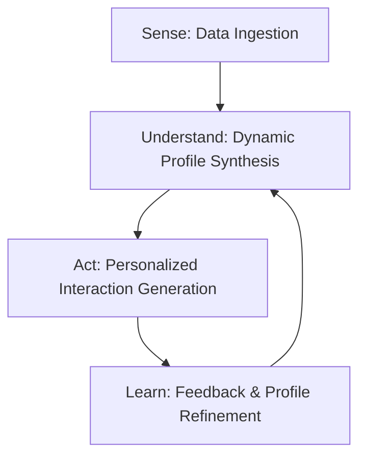

# Workflow: Hyper-Personalized AI Interaction System

## 1. Core Philosophy

Hyper-personalization moves beyond simply using a user's name. It is a continuous, cyclical process where the system develops a deep, dynamic understanding of a user's emotional state, cognitive patterns, and behavioral tendencies. Every interaction is tailored based on this evolving profile, and every interaction, in turn, refines that profile.

The workflow operates as a closed-loop system: **Sense -> Understand -> Act -> Learn**.

---

## 2. Detailed Stages of the Workflow

### **Stage 1: Sense - Multi-Modal Data Ingestion**

This stage is about gathering the raw materials for personalization from various sources.

* **Explicit Data Collection:**
    1.  **Onboarding:** A carefully designed initial questionnaire captures baseline information (e.g., primary goals, known stressors, communication preferences).
    2.  **Direct Feedback:** Users can explicitly rate the usefulness of AI responses (e.g., thumbs up/down), providing a clear signal for reinforcement learning.

* **Implicit Data Collection:**
    1.  **Interaction Logs:** Every message, journal entry, and interaction is captured. This is the richest source of data.
    2.  **Behavioral Metrics:** The system logs metadata such as the time of day the user is most active, session duration, and feature usage (e.g., how often they use the guided breathing tool).

* **Data Enrichment (NLP Pre-processing):**
    1.  As data is ingested, a background process enriches it.
    2.  **Sentiment Analysis:** Each message is tagged with a sentiment score (positive, negative, neutral).
    3.  **Entity & Theme Extraction:** NLP models identify key entities (e.g., "exam," "mother") and recurring themes ("academic pressure," "social anxiety," "loneliness"). This turns unstructured text into structured, usable data.

### **Stage 2: Understand - Dynamic User Profile Synthesis**

This is the core of the system. Instead of a static profile, we create a living, multi-dimensional representation of the user that is updated with every significant interaction.

* **The Dynamic Profile Object:** This can be a structured JSON object or a vector embedding stored in a database. It contains dimensions like:
    * **`current_emotional_state`**: A weighted average of recent sentiment scores.
    * **`cognitive_patterns`**: A list of identified cognitive distortions the user frequently exhibits (e.g., `["catastrophizing", "all-or-nothing_thinking"]`).
    * **`active_themes`**: A list of the most prominent topics the user is currently dealing with.
    * **`behavioral_archetype`**: A tag describing the user's interaction style (e.g., `late_night_ruminator`, `brief_morning_checker`).
    * **`communication_style`**: The user's preferred tone (e.g., `formal`, `empathetic`, `direct`).

* **Profile Update Mechanism:**
    1.  A background agent runs after each session.
    2.  It uses an LLM to analyze the latest enriched data and the existing profile.
    3.  The LLM's task is to "update the user profile with new insights." For example, if a user repeatedly uses words like "always" and "never," the agent might add `all-or-nothing_thinking` to their cognitive patterns.

### **Stage 3: Act - Agentic Interaction Generation**

This is where personalization becomes visible to the user. The AI's response is generated based not just on the last message, but on the entire synthesized profile.

* **Dynamic Prompt Engineering:** The prompt sent to the main LLM is constructed dynamically.
    * **Bad (non-personalized) Prompt:** `User said: "I failed my test." Respond.`
    * **Good (Hyper-Personalized) Prompt:** `SYSTEM: You are Eira, an empathetic companion. Your user's profile indicates a pattern of 'catastrophizing' and high 'academic pressure'. They prefer an 'empathetic' communication style. USER: "I failed my test. My life is over." INSTRUCTION: Acknowledge the user's distress and gently challenge the 'catastrophizing' pattern using a Socratic question.`

* **Personalized RAG (Retrieval-Augmented Generation):**
    1.  The system converts the user's query and **key themes from their profile** into a vector embedding.
    2.  It searches the vector database for relevant therapeutic techniques, articles, or exercises. This ensures that the retrieved content is relevant not just to the immediate query, but to the user's underlying issues.

* **Proactive Nudging:**
    1.  A separate scheduler agent monitors user profiles for specific triggers based on their `behavioral_archetype`.
    2.  **Example:** If a `late_night_ruminator` has been inactive for two days after a highly negative session, the agent can trigger a gentle, proactive check-in message: "Hey, just wanted to check in. Hope you're having an okay day. No pressure to reply."

### **Stage 4: Learn - Feedback Loop & Refinement**

The system's ability to learn is what makes the personalization "hyper."

1.  **Reinforcement Learning from Human Feedback (RLHF):** The explicit thumbs up/down ratings are used to fine-tune the response generation model. Responses that are rated highly are favored in the future.
2.  **Implicit Feedback Analysis:** The system analyzes engagement. If the user consistently engages with and completes suggested mindfulness exercises, the system learns that this is an effective tool for this specific user and will prioritize it in the future.
3.  **A/B Testing (Advanced):** The system can subtly test different response styles (e.g., more direct vs. more gentle) for a user and measure which one leads to better engagement, automatically adapting to the preferred style.

This complete workflow ensures that Eira becomes more intelligent, more empathetic, and more effective with every single conversation, creating a truly personalized and healing experience.